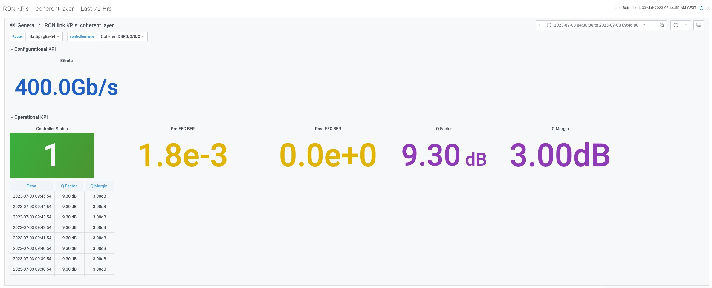
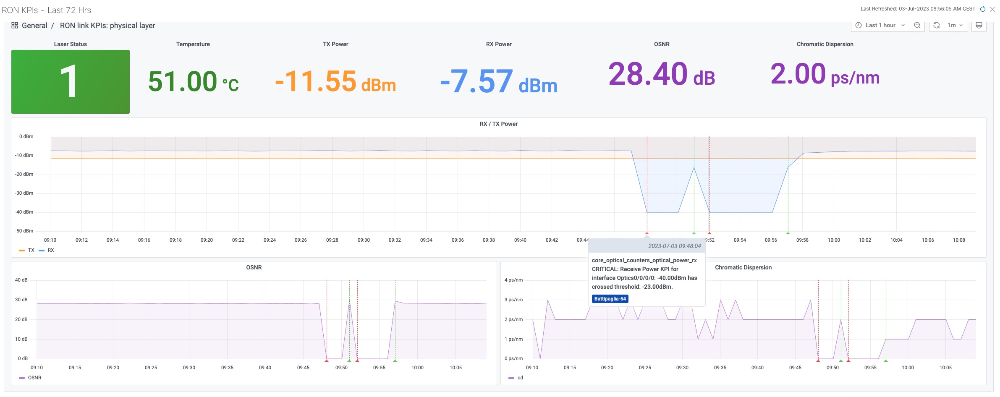
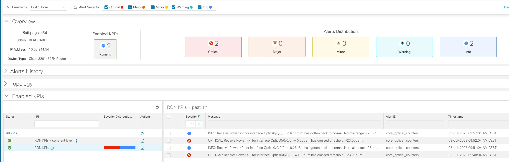
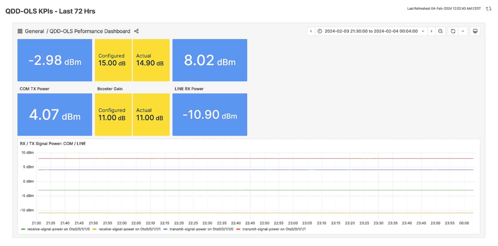

# Custom Crosswork Health Insights KPIs For Coherent Pluggables Monitoring

Cisco coherent interfaces offer advanced optical solutions for high-capacity, long-distance networking. These interfaces support data rates up to 800Gbps, utilizing advanced modulation formats like QPSK and 16-QAM for enhanced performance.
* [QSP-DD400G data sheet](https://www.cisco.com/c/en/us/products/collateral/interfaces-modules/transceiver-modules/datasheet-c78-744377.html)
* [QSFP-DD800G data sheet](https://www.cisco.com/c/en/us/products/collateral/interfaces-modules/transceiver-modules/qsfp-dd800-transceiver-modules-ds.html)

The custom KPIs in this repository enable enhanced monitoring of coherent interfaces in Cisco routers using Crosswork Health Insights. They leverage Cisco's telemetry interfaces and native YANG models to provide detailed performance insights.

1. DCO Coherent KPIs - Set of KPIs such as Q Margin / Factor, Pre/Post FEC BER, etc., related to coherent transport.
    * No TCA defined yet (TBD)

2. Optical KPIs - Set of KPIs such as TX/RX power, OSNR, etc., related to optical physical layer.
    * TCA can be defined for up to three optical controllers separately or for all controllers within a router. TCA establishes a range of acceptable power levels, and an alert is triggered if the TX/RX power falls outside this range.

3. QDD-OLS KPIs - KPIs for optical amplifiler such as client, line power, pre amp and booster gain.

Inside each folder, there are source files with KPI definitions (telemetry path, dashboard, TCA) and ready-to-use compiled .tgz files.

## KPI installation

1. Go to Performance Alerts -> Key Performance Indicators (KPI).
2. Click on "Import KPI" and select **.tgz** file.
3. Attach a new KPI to the KPI Profile, similar to the standard one.
